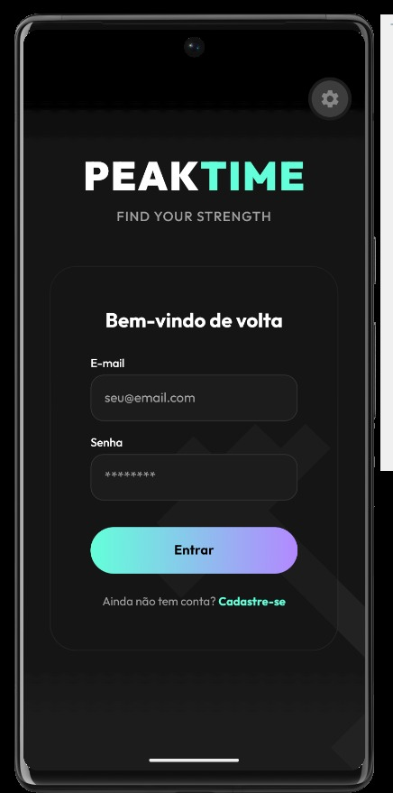
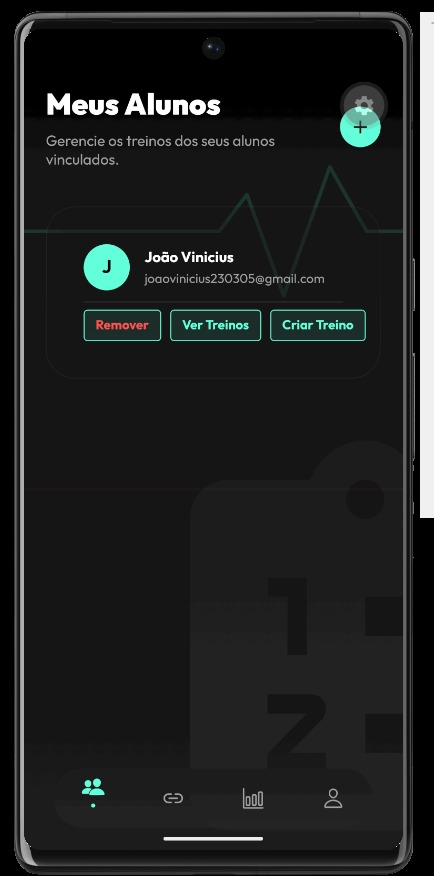
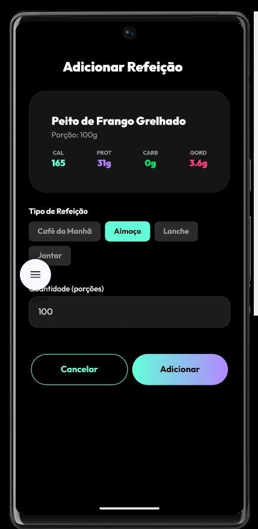
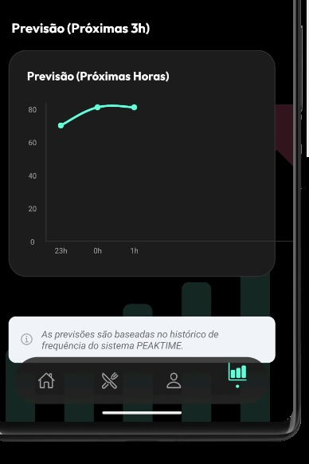

# PeakTime

A modern cross-platform fitness application built with React Native, Expo, and TypeScript. PeakTime allows students to follow personalized workout and nutrition plans while giving instructors the tools to manage trainees, create training programs, and monitor progress.

## Disclaimer

This repository is part of my personal portfolio.

The project was originally developed as a university team project and is published here with the permission of my teammates.

This repository showcases my work and contributions to the project.

### My Contributions

- Developed the mobile application using React Native and Expo.
- Built reusable UI components.
- Implemented authentication flows.
- Integrated the application with the backend REST API.
- Improved the user experience and fixed bugs.

---

## Features

### Student

- Daily workout tracking
- Nutrition diary
- Weekly activity overview
- Progress monitoring
- Professor invitation system

### Professor

- Student management
- Weekly workout plan creation
- Invitation code generation
- Profile management

---

## Tech Stack

- React Native
- Expo SDK 56
- TypeScript
- Expo Router
- Tamagui
- React Native Reanimated
- Expo Secure Store

---

## Architecture

```
src/
├── app/
├── components/
├── hooks/
├── services/
├── constants/
├── types/
```

The application follows a modular architecture separating routing, reusable UI components, business logic, hooks, and API services.

---

## Screenshots

<p align="center">
  
  
  
  
  
</p>

---

## Running the Project

Install dependencies

```bash
npm install
```

Start Expo

```bash
npx expo start
```

Available commands:

- **a** → Android
- **i** → iOS
- **w** → Web

---

## Project Structure

The application is divided into two user roles:

### Student

- Authentication
- Workout Management
- Nutrition Tracking
- Profile

### Professor

- Student Dashboard
- Workout Builder
- Invitation Management
- Profile

---

## Security

Authentication tokens are securely stored using **Expo Secure Store** on native platforms and **localStorage** on the web.

---

## Backend

This application depends on a private backend API that is not included in this repository.

The backend was developed as part of the same university team project. This repository focuses on the mobile application and the work I contributed to it.

Because the backend is private, the application cannot be fully run without access to the corresponding API and environment configuration.

## License

This repository is intended for portfolio purposes.
