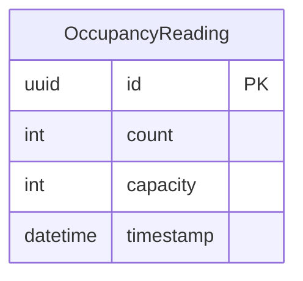

# Data Model: Monitoramento de Ocupação

**Feature**: Tela de ocupação em tempo real  
**Date**: 2026-06-04

## Entities

### OccupancyReading

Registra uma leitura de ocupação da academia em um momento específico.

| Field | Type | Constraints | Description |
|-------|------|-------------|-------------|
| `id` | UUID | PK, auto-generated | Identificador único |
| `count` | Integer | NOT NULL, >= 0 | Número de pessoas na academia |
| `capacity` | Integer | NOT NULL, > 0 | Capacidade máxima configurada |
| `timestamp` | DateTime | NOT NULL, default: now() | Momento exato da leitura |

**Validation Rules**:
- `count` deve ser >= 0 e <= `capacity`
- `capacity` deve ser > 0

**Indexes**:
- `timestamp` (para queries por intervalo de datas)

### Derived Values (não persistidos)

| Value | Cálculo | Descrição |
|-------|---------|-----------|
| `percentage` | `(count / capacity) * 100` | Porcentagem de ocupação |
| `level` | Baseado no `percentage` | Nível textual de lotação |

### Occupancy Level Mapping

| Level | Label PT | Faixa (%) | Cor Hex |
|-------|----------|-----------|---------|
| `EMPTY` | Vazio | 0–15 | `#64FFDA` |
| `QUIET` | Tranquilo | 16–35 | `#00E676` |
| `MODERATE` | Moderado | 36–60 | `#FFC107` |
| `BUSY` | Cheio | 61–85 | `#FF9800` |
| `FULL` | Lotado | 86–100 | `#FF4081` |

## Relationships

**Nota**: `OccupancyReading` é uma entidade independente (não vinculada a `User`). Ela reflete o estado global da academia, acessível por todos os usuários autenticados.

## State Transitions

A ocupação não possui transições de estado formais. Cada leitura é um snapshot imutável. O frontend calcula o nível de lotação dinamicamente a partir do `percentage`.

## Forecast Logic

A previsão é calculada no backend via query SQL:
1. Buscar todas as leituras das últimas 4 semanas para o mesmo `dayOfWeek`
2. Agrupar por hora do dia
3. Calcular a média de `count` por hora
4. Retornar como array de `{ hour: number, avgCount: number }`
